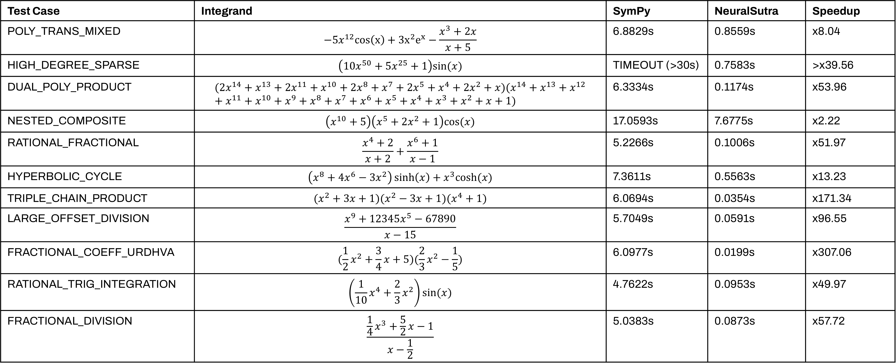

# NeuralSutra
**NeuralSutra** is a hybrid neuro-symbolic engine for fast symbolic integration and polynomial arithmetic. It combines a mathematical compiler with a Bi-Directional LSTM-based "intent" classifier that examines the structure of SymPy expressions and "routes" them to specialised Vedic mathematics algorithms (kernels).

## Performance benchmarks

The results below demonstrate the execution time of NeuralSutra compared to SymPy (specifically, calling `sympy.integrate()` on the desired expression to integrate). One can replicate these results by following the instructions in the [Installation and Setup](#-installation-and-setup) section.



> **Note:** Due to the stochastic nature of neural routing and hardware variances, exact results may vary. However, NeuralSutra consistently delivers significant speedups on the integration of deep, sparse polynomial chains and high-degree rational expressions.

---

## How it works

NeuralSutra follows a four-stage pipeline:

1. **Synthetic data generation**: A synthetic curriculum-style dataset of symbolic SymPy AST (Abstract Syntax Tree) sequences is generated. Each sequence is labelled with a specific mathematical "intent" (currently one of multiplication, division, integration or fallback).
2. **Neural intent routing**: A Bi-Directional LSTM model trained on the synthetic data classifies the incoming SymPy expression into the mathematical "intent" based on its structure.
3. **Vedic kernel execution**: Based on the predicted mathematical "intent", the expression is routed to specialised kernels (algorithms) that implement Vedic sutras.
4. **Fixed-point iteration compiler**: The compiler recursively decomposes nested expressions until they reach a form compatible with the Vedic kernels, using SymPy as a failover.

### What is Vedic mathematics?

Vedic mathematics is a system of mathematical reasoning based on sixteen Sutras (aphorisms or word-formulae).

**[Read my essay: "By One More Than The Previous One: A Primer on Vedic Mathematics"](https://tomrocksmaths.com/wp-content/uploads/2024/08/by-one-more-than-the-previous-one-a-primer-on-vedic-mathematics-sai-tadepalli.pdf)**

---

## Verification and symbolic correctness

NeuralSutra verifies the result of integrations using three steps:
1. **Fundamental Theorem of Calculus**: Integration results are differentiated using `sympy.diff()`. The derivative is compared against the original integrand to ensure symbolic equivalence.
2. **Numerical sampling**: For complex expressions where symbolic simplification is too computationally expensive, the engine evaluates both the original integrand and the derivative of the result at specific integer sample points and checks that they match within a tolerance.
3. **Automatic failover**: Any expression that fails verification or triggers an exception in a Vedic kernel is automatically routed to standard SymPy methods.

---

## Installation and setup

### Prerequisites
* Python 3.11+
* PyTorch (for the Bi-LSTM model)
* SymPy
* scikit-learn

### Installation
**1. Clone the repository:**
```
git clone https://github.com/SaiNikhilTadepalli/NeuralSutra.git
cd NeuralSutra
```

**2. Install dependencies and project:**
```
pip install -r requirements.txt
pip install -e .
```

*The `-e .` command installs NeuralSutra in **editable mode**. This maps the `src/neuralsutra` directory to your Python environment, allowing the scripts to find the package*

**3. Train the router model:**
```
python -m scripts.train
```

*The default configuration will generate `router.pth` and `vocab.json` within the `models/` directory.*

**4. Run the benchmark suite:**
```
python -m scripts.benchmark
```

### General usage

NeuralSutra can be used as a drop-in replacement for SymPy symbolic integration:
```python
from neuralsutra.compiler import Compiler
from neuralsutra.verification import verify_integration

from sympy import Symbol, sin

# Initialise the compiler
try:
    compiler = Compiler("models/router.pth", "models/vocab.json")
except FileNotFoundError:
    return print("Error: model files missing from 'models/'.")

# Build the SymPy expression to integrate
x = Symbol("x")
expr = (x**2 + 5*x + 6) * sin(x)

# Use NeuralSutra to integrate the expression
result = compiler.compile(expr=expr, var=x)

# Verify correctness
print(verify_integration(expr, result, x))  # True

# Print result
print(result)
```

---

## Future improvements

While NeuralSutra currently demonstrates significant performance gains, I am looking to implement the following improvements at some point in the future:
* **Variable agnosticism**: Currently, the kernels assume a univariate expression in $x$. I plan to implement automated symbol detection to allow the engine to handle any user-defined variable and multivariable expressions.
* **Stronger compiler testing**: I plan to implement a more rigorous test suite including edge case handling, non-symbolic input validation and property-based testing, using a framework like `Hypothesis`, to generate random mathematical expressions to verify that the SymPy fallback mechanism is triggered correctly.
* **Expanded sutra coverage**: I am exploring the addition of more Sutras to cover a wider range of optimisations, such as using **Anurupyena** to accelerate power-of-polynomial calculations or **Nikhilam** for series expansions.
* **Verbosity and debugging tools**: I plan to implement a verbose logging mode to trace the identified "intent" of the Bi-LSTM model, the specific Vedic kernel selected and possibly even how the SymPy expression tree is pruned during each compilation pass.
* **Robust input handling**: I aim to extend the compiler's input validation to handle non-SymPy objects, malformed strings and raw LaTeX inputs with graceful failover.
* **Hardware acceleration**: Porting the coefficient convolution loops in the **Urdhva Tiryagbhyam** multiplication kernel from Python to CUDA.
